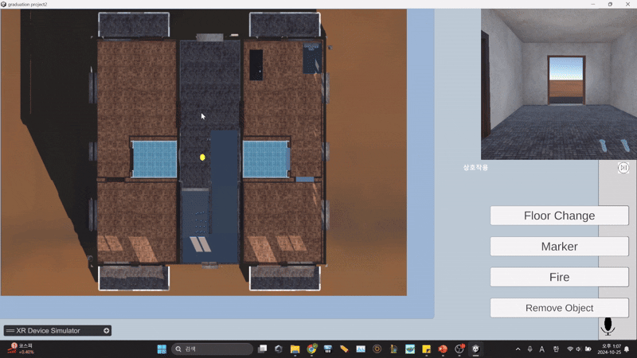
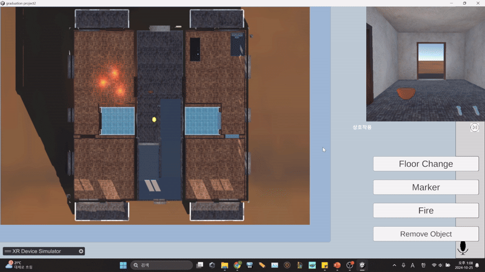
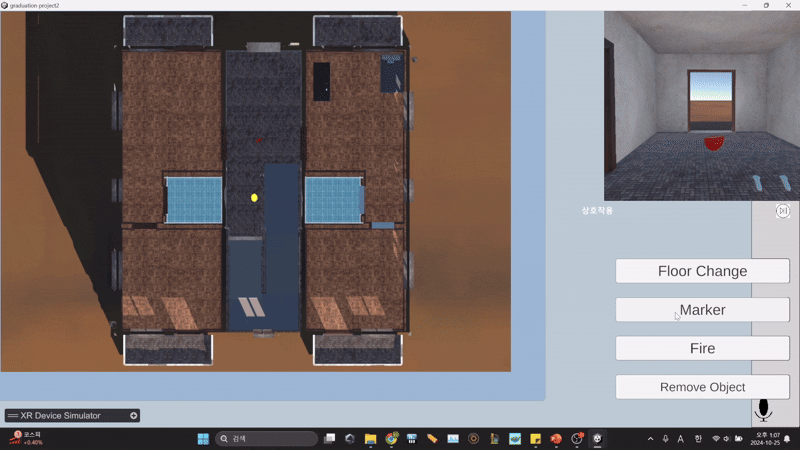
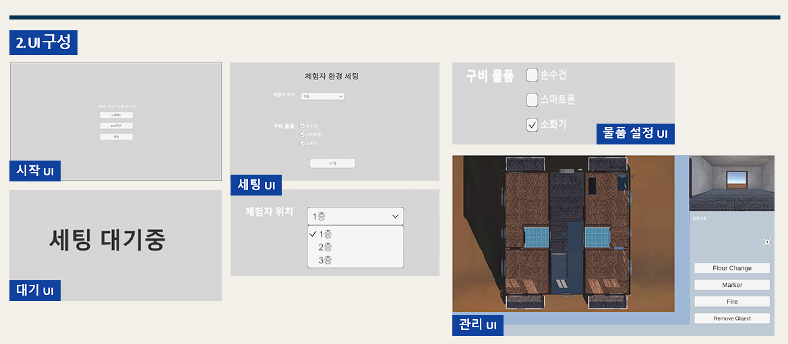
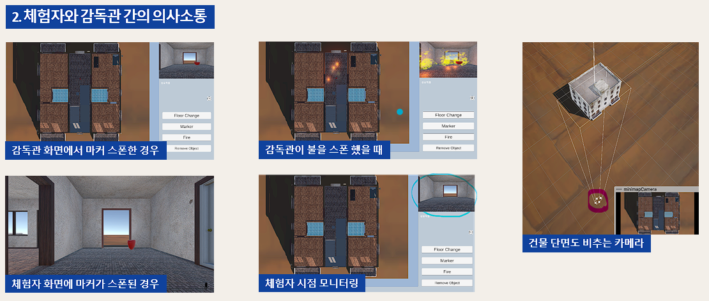
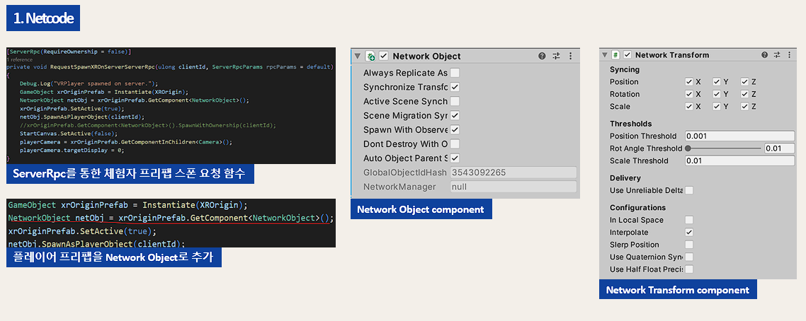
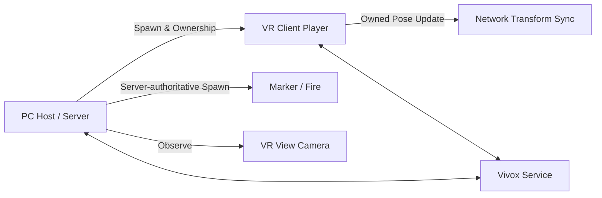

# VR Disaster Simulation — Networking Portfolio

PC 관제자와 VR 참가자가 하나의 재난 훈련 공간을 공유하는 3인 팀 프로젝트입니다. 멀티플레이 연결, 플레이어 생성과 소유권 이전, 위치 동기화, PC 관제 상호작용과 음성 기능 연동을 담당했습니다.

> [프로젝트 시연 영상](https://www.youtube.com/watch?v=iOX_i1il5Sw) · [네트워크 구조](docs/architecture.md) · [담당 범위](docs/contribution.md)

## 동작 한눈에 보기

<table>
<tr>
<td width="50%" valign="top">
 
<strong>PC 관제 — 목표 마커 생성</strong> 
미니맵에서 지정한 위치에 참가자 안내용 마커를 생성합니다.
</td>
<td width="50%" valign="top">
 
<strong>VR Client — 참가자 시점</strong> 
VR 참가자가 재난 훈련 공간을 탐색하고 오브젝트와 상호작용합니다.
</td>
</tr>
<tr>
<td width="50%" valign="top">
 
<strong>PC 관제 — 층 이동</strong> 
관제 화면에서 참가자의 훈련 층을 전환합니다.
</td>
<td width="50%" valign="top">
 
<strong>PC 관제 — 화재 생성·제거</strong> 
화재 오브젝트를 배치하거나 제거해 훈련 상황을 조정합니다.
</td>
</tr>
</table>

## 프로젝트 정보

| 항목 | 내용 |
|---|---|
| 개발 기간 | 24.08 ~ 24.11 |
| 형태 | 3인 팀 프로젝트 |
| 담당 | 멀티플레이 연결·설정, 플레이어 생성·동기화, PC 관제 상호작용, Vivox 연동과 UI 최적화 |
| 실행 역할 | PC Host/Server 1명 ↔ VR Client 1명 |
| 개발 환경 | Unity 2022.3.35f1, C# |
| 주요 기술 | Netcode for GameObjects 1.9.1, XR Interaction Toolkit 2.5.4, Vivox 16.5.2 |

## 화면 구성

시작·참가자 설정·대기 화면과 PC 관제 화면을 역할별로 분리했습니다. 관제 화면에서는 참가자 시점 모니터링과 층 이동, 마커·화재 제어를 한곳에서 수행합니다.

## 해결한 핵심 과제

### 1. PC 관제자와 VR 참가자의 역할 분리

Host는 PC 관제 화면을 사용하고, 연결된 Client에는 VR 플레이어를 생성했습니다. 서버가 플레이어 오브젝트를 생성·등록하고 Client에 소유권을 넘긴 뒤 각 기기에 필요한 UI와 플레이어 상태를 분리했습니다.

### 2. VR 입력 반응성과 서버 관리의 균형

공유 오브젝트 생성은 서버가 담당하고, 머리와 양손을 포함한 VR 플레이어 Transform은 소유 Client가 갱신하도록 구성했습니다. 생성 주체는 서버로 유지하면서 VR 입력 반응성을 확보하기 위한 권한 분리입니다.

### 3. 관제 화면을 실시간 피드백 도구로 연결

PC 미니맵 좌표를 Raycast로 월드 좌표로 변환한 뒤 마커와 화재 오브젝트를 서버에서 생성·제거했습니다. 마커는 한 번에 하나만 유지하고, 화재는 최대 개수를 제한해 관제자가 참가자의 이동 목표와 훈련 난이도를 조절하도록 했습니다.

### 4. 비동기 생성 순서 처리

Client 연결 직후에는 플레이어 NetworkObject 등록이 끝나지 않을 수 있습니다. 등록 완료를 기다린 뒤 관제 카메라 추적과 층 이동 기능을 연결해 초기화 순서에 따른 빈 참조를 방지했습니다.

## 대표 코드 바로가기

| 코드 | 확인할 내용 |
|---|---|
| [`NetworkConnect.cs`](src/networking/NetworkConnect.cs) | Host/Client 시작, 연결 대기, 서버의 VR 플레이어 생성과 소유권 이전 |
| [`NetworkPlayer.cs`](src/networking/NetworkPlayer.cs) | 소유 Client의 HMD·양손 Transform 반영 |
| [`NetworkTransformClient.cs`](src/networking/NetworkTransformClient.cs) | VR 플레이어의 Client-authoritative Transform 설정 |
| [`minimapClickHandler.cs`](src/networking/minimapClickHandler.cs) | 미니맵 좌표 변환, 서버 권한 마커·화재 생성·삭제와 개수 제한 |
| [`PlayerSpawnPlace.cs`](src/networking/PlayerSpawnPlace.cs) | NetworkObject 등록 대기, ServerRpc/ClientRpc 기반 위치 이동 |

연동 코드: [`NetworkObjectManager.cs`](src/networking/NetworkObjectManager.cs) · [`VrPlayerViewCameraController.cs`](src/networking/VrPlayerViewCameraController.cs) · [`PCScene.cs`](src/networking/PCScene.cs) · [`VoiceChat.cs`](src/networking/VoiceChat.cs)

### Netcode 적용 구성

서버의 VR 플레이어 생성 요청과 `NetworkObject` 소유권 설정, `NetworkTransform` 동기화 구성을 함께 적용했습니다. 실제 구현은 위 대표 코드 링크에서 확인할 수 있습니다.

## 네트워크 구조

세부 권한과 생성 흐름은 [Architecture](docs/architecture.md)에서 확인할 수 있습니다.

## 담당 범위

- Host/Client 시작과 연결 완료 대기
- 접속 Client용 VR 플레이어의 서버 생성·등록·소유권 이전
- HMD·양손 Transform 반영과 Client-authoritative 동기화
- ServerRpc/ClientRpc를 이용한 위치 이동과 화면 상태 전환
- 미니맵 좌표의 월드 좌표 변환과 서버 권한 마커·화재 관리
- 관제 카메라의 VR 참가자 시점 연결
- Vivox SDK·제공 샘플을 활용한 음성 서비스와 마이크 버튼 UI 연동

## 추가 자료

[공개 범위와 저작권](NOTICE.md) · [코드 확인 기록](docs/verification.md)
