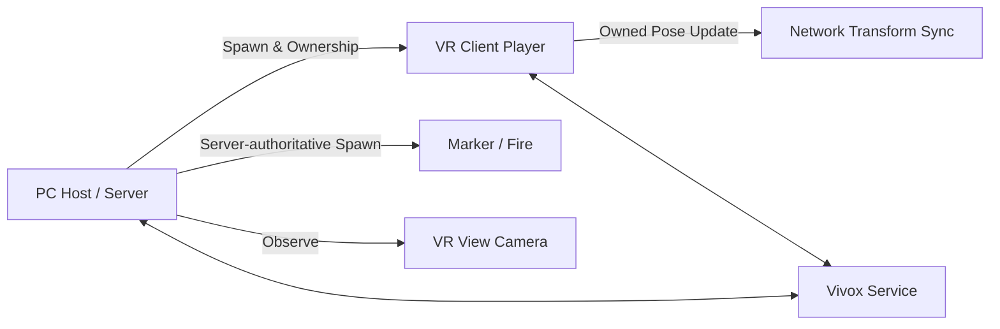

# VR Disaster Simulation — Networking Portfolio

PC 관제자와 VR 훈련 참가자가 하나의 재난 현장을 공유하고, 관제자가 참가자의 시점을 확인하며 실시간으로 안내·난이도 조절·음성 피드백을 제공하도록 구현한 3인 팀 프로젝트의 **네트워크 담당 코드 선별본**입니다.

> [프로젝트 시연 영상](https://www.youtube.com/watch?v=iOX_i1il5Sw) · 전체 흐름을 먼저 확인한 뒤 아래 핵심 코드 5개를 보면 담당 범위를 빠르게 파악할 수 있습니다.

| 항목 | 내용 |
| --- | --- |
| 개발 기간 | 약 3개월 |
| 팀 구성 | 3인 팀 |
| 담당 | 멀티플레이 연결·설정, 플레이어 생성·동기화, PC 관제 상호작용, Vivox 연동과 UI 최적화 |
| 실행 역할 | PC Host/Server 1명 ↔ VR Client 1명 |
| 개발 환경 | Unity 2022.3.35f1, C# |
| 주요 기술 | Netcode for GameObjects 1.9.1, XR Interaction Toolkit 2.5.4, Vivox 16.5.2 |

최종보고서의 역할 분담표에서 담당 범위가 **기기 간 Netcode 연결·설정, 미니맵과 마커를 이용한 1:1 의사소통, UI 디자인·최적화, Vivox 음성 채팅 연동**으로 구분돼 있음을 확인했습니다. 원본 문서는 개인정보와 팀 전체 자료를 포함하므로 저장소에는 복제하지 않고, 기술 내용과 코드의 대응 관계만 [검증 근거](docs/verification.md)에 정리했습니다.

## 해결한 핵심 과제

### 1. PC 관제자와 VR 참가자의 역할 분리

Host는 PC 관제 화면을 사용하고, 연결된 Client에는 VR 플레이어를 생성했습니다. 서버가 플레이어 오브젝트를 생성·등록하고 Client에 소유권을 넘긴 뒤 각 기기에 필요한 UI와 플레이어 상태를 분리했습니다.

### 2. VR 입력 반응성과 서버 관리의 균형

공유 오브젝트 생성은 서버가 담당하고, 머리와 양손을 포함한 VR 플레이어 Transform은 소유 Client가 갱신하도록 분리했습니다. 서버 권한만 고집할 때 생길 수 있는 VR 조작 지연을 줄이면서 생성 주체는 서버로 유지했습니다.

### 3. 관제 화면을 실시간 피드백 도구로 연결

PC 미니맵 좌표를 Raycast로 월드 좌표로 변환한 뒤, 마커와 화재 오브젝트를 서버에서 생성·제거하도록 구현했습니다. 마커는 한 번에 하나만 유지해 참가자의 이동 목표를 명확하게 전달하고, 화재는 최대 개수를 제한하되 초과 시 가장 오래된 오브젝트를 제거해 관제자가 시나리오 난이도를 동적으로 조절하도록 했습니다.

### 4. 참가자 시점 모니터링과 비동기 생성 순서 처리

클라이언트 연결 직후에는 플레이어 NetworkObject 등록이 끝나지 않을 수 있어, 등록 완료를 기다린 뒤 관제 카메라 추적과 층 이동 기능을 연결했습니다. 카메라는 참가자 머리 Transform을 따라가고, 이동 요청은 ServerRpc로 전달한 뒤 결과를 ClientRpc로 반영했습니다.

## 핵심 코드 바로 보기

| 코드 | 확인할 내용 |
| --- | --- |
| [`NetworkConnect.cs`](src/networking/NetworkConnect.cs) | Host/Client 시작, 연결 대기, 서버의 VR 플레이어 생성과 소유권 이전 |
| [`NetworkPlayer.cs`](src/networking/NetworkPlayer.cs) | 소유 Client의 HMD·양손 Transform 반영 |
| [`NetworkTransformClient.cs`](src/networking/NetworkTransformClient.cs) | VR 플레이어의 Client-authoritative Transform 설정 |
| [`minimapClickHandler.cs`](src/networking/minimapClickHandler.cs) | 미니맵 좌표 변환, 서버 권한 마커·화재 생성/삭제, 개수 제한 |
| [`PlayerSpawnPlace.cs`](src/networking/PlayerSpawnPlace.cs) | NetworkObject 등록 대기, ServerRpc/ClientRpc 기반 위치 이동 |

## 연동 코드

- [`NetworkObjectManager.cs`](src/networking/NetworkObjectManager.cs): 생성된 NetworkObject 등록과 Client 통지
- [`VrPlayerViewCameraController.cs`](src/networking/VrPlayerViewCameraController.cs): 관제 카메라의 VR 플레이어 시점 추적
- [`PCScene.cs`](src/networking/PCScene.cs): PC 관제 화면 전환과 음성 UI 활성화
- [`VoiceChat.cs`](src/networking/VoiceChat.cs): 음성 채팅 마이크 버튼의 UI 상태 제어

최종보고서에는 Vivox 패키지·기본 UI·샘플 코드를 활용해 음성 서버 접속, 입출력 장치 선택과 음량 조절을 연동한 내용이 기록돼 있습니다. 이 저장소는 음성 코덱이나 전송 프로토콜을 직접 구현했다고 주장하지 않으며, 선별된 `VoiceChat.cs`도 직접 작성한 마이크 버튼 UI 상태 제어만 보여줍니다. Vivox SDK·샘플·서비스 설정은 포함하지 않았습니다.

## 구조와 검증 근거

- 원본의 네트워크 관련 스크립트 11개를 검토하고, 최종 호출 경로가 확인된 9개를 선별했습니다.
- 최종보고서와 포스터의 네트워크 장·역할 분담·시스템 구성을 현재 코드와 대조했습니다.
- 선별본에는 동작을 바꾸지 않는 범위에서 주석 인코딩, 사용하지 않는 주석 코드와 개발 확인용 로그를 정리했습니다.
- 팀원의 기능, 에셋, 서비스 설정, 빌드 산출물은 포함하지 않았습니다.
- 전체 프로젝트 실행본이 아니라 **담당 코드 검토를 위한 포트폴리오 저장소**입니다.

더 자세한 내용은 [네트워크 구조](docs/architecture.md), [기여 범위](docs/contribution.md), [검증 근거](docs/verification.md), [선별 원칙](NOTICE.md)에서 확인할 수 있습니다.
