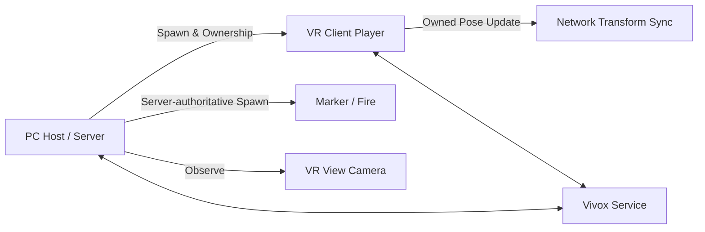

# VR Disaster Simulation — Networking Portfolio

PC 관제자와 VR 훈련 참가자가 하나의 재난 현장을 공유하도록 연결·동기화·관제 상호작용을 구현한 3인 팀 프로젝트의 **네트워크 담당 코드 선별본**입니다.

> [프로젝트 시연 영상](https://www.youtube.com/watch?v=iOX_i1il5Sw) · 전체 흐름을 먼저 확인한 뒤 아래 핵심 코드 5개를 보면 담당 범위를 빠르게 파악할 수 있습니다.

| 항목 | 내용 |
| --- | --- |
| 개발 기간 | 약 3개월 |
| 팀 구성 | 3인 팀 |
| 담당 | 멀티플레이 연결, 플레이어 생성·동기화, PC 관제 연동 |
| 실행 역할 | PC Host/Server 1명 ↔ VR Client 1명 |
| 개발 환경 | Unity 2022.3.35f1, C# |
| 주요 기술 | Netcode for GameObjects 1.9.1, XR Interaction Toolkit 2.5.4, Vivox 16.5.2 |

## 해결한 핵심 과제

### 1. PC 관제자와 VR 참가자의 역할 분리

Host는 PC 관제 화면을 사용하고, 연결된 Client에는 VR 플레이어를 생성했습니다. 서버가 플레이어 오브젝트를 생성·등록하고 Client에 소유권을 넘겨 각 기기에서 필요한 UI와 XR Origin만 활성화하도록 구성했습니다.

### 2. VR 입력 반응성과 서버 관리의 균형

공유 오브젝트 생성은 서버가 담당하고, 머리와 양손을 포함한 VR 플레이어 Transform은 소유 Client가 갱신하도록 분리했습니다. 서버 권한만 고집할 때 생길 수 있는 VR 조작 지연을 줄이면서 생성 주체는 서버로 유지했습니다.

### 3. 관제 화면에서 현장에 개입하는 상호작용

PC 미니맵 좌표를 월드 좌표로 변환한 뒤, 마커와 화재 오브젝트를 서버에서 생성·제거하도록 구현했습니다. 화재는 최대 개수를 제한하고 초과 시 가장 오래된 오브젝트를 제거했습니다.

### 4. 비동기 생성 순서 처리

클라이언트 연결 직후에는 플레이어 NetworkObject 등록이 끝나지 않을 수 있어, 등록 완료를 기다린 뒤 카메라 추적과 층 이동 기능을 연결했습니다. 이동 요청은 ServerRpc로 전달하고 결과를 ClientRpc로 반영했습니다.

## 핵심 코드 바로 보기

| 코드 | 확인할 내용 |
| --- | --- |
| [`NetworkConnect.cs`](src/networking/NetworkConnect.cs) | Host/Client 시작, 연결 대기, 서버의 VR 플레이어 생성과 소유권 이전 |
| [`NetworkPlayer.cs`](src/networking/NetworkPlayer.cs) | 소유 Client의 HMD·양손 Transform 반영 |
| [`NetworkTransformClient.cs`](src/networking/NetworkTransformClient.cs) | VR 플레이어의 Client-authoritative Transform 설정 |
| [`minimapClickHandler.cs`](src/networking/minimapClickHandler.cs) | 미니맵 좌표 변환, 서버 권한 마커·화재 생성/삭제, 개수 제한 |
| [`PlayerSpawnPlace.cs`](src/networking/PlayerSpawnPlace.cs) | NetworkObject 등록 대기, ServerRpc/ClientRpc 기반 위치 이동 |

## 연동 코드

- [`NetworkObjectManager.cs`](src/networking/NetworkObjectManager.cs): 생성된 NetworkObject 등록과 Client 통지
- [`XrOriginManager.cs`](src/networking/XrOriginManager.cs): 대상 Client에만 XR Origin 활성화/비활성화
- [`VrPlayerViewCameraController.cs`](src/networking/VrPlayerViewCameraController.cs): 관제 카메라의 VR 플레이어 시점 추적
- [`PCScene.cs`](src/networking/PCScene.cs), [`PCManager.cs`](src/networking/PCManager.cs): PC 관제 화면과 렌더링 연동 보조
- [`VoiceChat.cs`](src/networking/VoiceChat.cs): 음성 채팅 마이크 버튼의 UI 상태 제어

Vivox는 SDK와 제공 샘플을 활용해 프로젝트에 연동했습니다. 이 저장소는 음성 코덱이나 전송 프로토콜을 직접 구현했다고 주장하지 않으며, `VoiceChat.cs`도 Vivox 통신 코드가 아닌 UI 보조 코드입니다.

## 구조와 검증 근거

- 선별된 11개 스크립트는 팀 프로젝트의 실제 Unity 씬 또는 프리팹에서 참조됩니다.
- 팀원의 기능, 에셋, 서비스 설정, 빌드 산출물은 포함하지 않았습니다.
- 전체 프로젝트 실행본이 아니라 **담당 코드 검토를 위한 포트폴리오 저장소**입니다.

더 자세한 내용은 [네트워크 구조](docs/architecture.md), [기여 범위](docs/contribution.md), [검증 근거](docs/verification.md), [선별 원칙](NOTICE.md)에서 확인할 수 있습니다.
