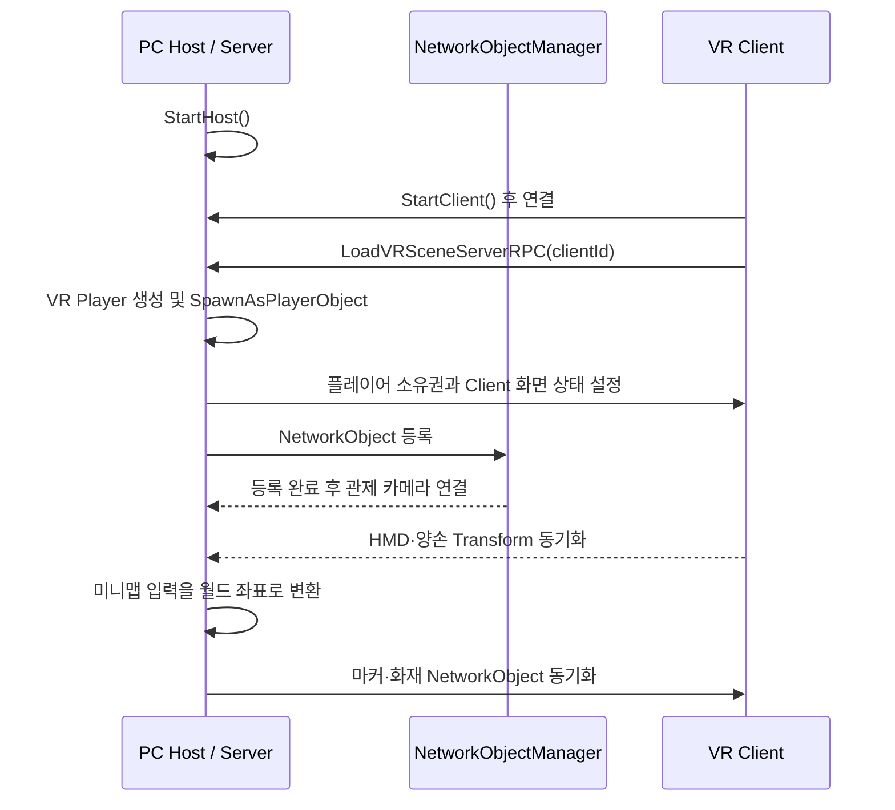
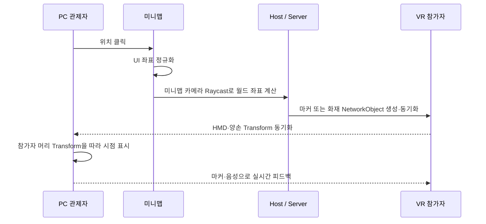

# 네트워크 구조

## 실행 역할

- **PC Host/Server:** 세션 시작, VR 플레이어 생성, 관제 화면과 미니맵 상호작용 관리
- **VR Client:** 서버 접속, XR Origin 활성화, HMD·양손 위치 갱신
- **Vivox:** SDK와 제공 샘플을 활용한 음성 서비스 연동

## 권한 설계

| 대상 | 권한 | 선택 이유 | 관련 코드 |
| --- | --- | --- | --- |
| VR 플레이어 생성 | Server | 접속 Client ID에 맞춰 생성과 등록을 일관되게 관리 | [`NetworkConnect.cs`](../src/networking/NetworkConnect.cs) |
| HMD·양손 Transform | Owner Client | VR 입력 반응성을 유지 | [`NetworkPlayer.cs`](../src/networking/NetworkPlayer.cs), [`NetworkTransformClient.cs`](../src/networking/NetworkTransformClient.cs) |
| 미니맵 마커·화재 | Server | 모든 사용자에게 동일한 공유 상태 제공 | [`minimapClickHandler.cs`](../src/networking/minimapClickHandler.cs) |
| 층 이동 요청 | ServerRpc → ClientRpc | 요청 주체와 적용 결과를 네트워크에 반영 | [`PlayerSpawnPlace.cs`](../src/networking/PlayerSpawnPlace.cs) |

## 생성 순서 처리

플레이어가 생성되기 전에 관제 카메라나 이동 UI가 접근하면 참조가 비어 있을 수 있습니다. `NetworkObjectManager`가 생성된 오브젝트를 등록하고, 의존 기능은 등록 완료를 기다린 뒤 초기화하도록 구성했습니다.

## 관제 상호작용 흐름

### 마커와 화재의 상태 규칙

- 안내 마커는 한 개만 유지하며 새 위치를 선택하면 기존 마커를 제거합니다.
- 화재는 기본 최대 5개까지 유지하고, 한도를 넘으면 가장 오래된 화재부터 제거합니다.
- 우클릭 또는 제거 버튼으로 현재 마커·화재를 네트워크에서 `Despawn`합니다.
- 생성과 제거는 Host/Server 여부를 확인한 뒤 수행해 공유 상태를 한쪽에서 관리합니다.

이 상호작용은 단순한 맵 편집이 아니라 관제자가 참가자의 이동 목표와 위험 요소를 세션 중 변경해 실시간 피드백과 난이도 조절을 제공하기 위한 기능입니다.
