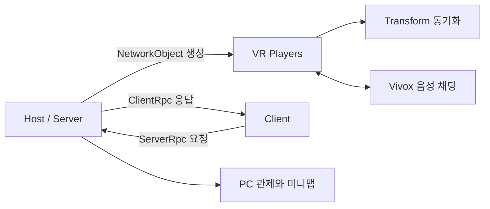

# 네트워크 구조

## 연결과 생성

1. 사용자가 Host 또는 Client 연결을 선택합니다.
2. Client는 입력된 접속 정보를 이용해 연결합니다.
3. 서버가 네트워크 오브젝트의 생성과 등록을 관리합니다.
4. 클라이언트별 XR Origin과 플레이어 표현을 활성화합니다.
5. 생성 완료 후 위치 이동과 관제 화면 연결을 수행합니다.

## 권한 선택

- 화재와 마커처럼 공유 상태에 영향을 주는 오브젝트는 서버 요청을 거쳐 생성합니다.
- 플레이어 이동은 VR 입력 반응성을 고려해 클라이언트 권한 Transform을 사용합니다.
- 특정 사용자에게만 필요한 처리는 대상 ClientRpc로 전달합니다.

