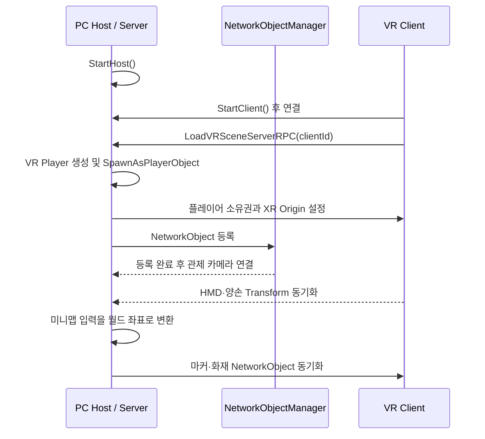

# 네트워크 구조

## 실행 역할

- **PC Host/Server:** 세션 시작, VR 플레이어 생성, 관제 화면과 미니맵 상호작용 관리
- **VR Client:** 서버 접속, XR Origin 활성화, HMD·양손 위치 갱신
- **Vivox:** SDK와 제공 샘플을 활용한 음성 서비스 연동

## 권한 설계

| 대상 | 권한 | 선택 이유 | 관련 코드 |
| --- | --- | --- | --- |
| VR 플레이어 생성 | Server | 접속 Client ID에 맞춰 생성과 등록을 일관되게 관리 | [`NetworkConnect.cs`](../src/networking/NetworkConnect.cs) |
| HMD·양손 Transform | Owner Client | VR 입력 반응성을 유지 | [`NetworkPlayer.cs`](../src/networking/NetworkPlayer.cs), [`NetworkTransformClient.cs`](../src/networking/NetworkTransformClient.cs) |
| 미니맵 마커·화재 | Server | 모든 사용자에게 동일한 공유 상태 제공 | [`minimapClickHandler.cs`](../src/networking/minimapClickHandler.cs) |
| 층 이동 요청 | ServerRpc → ClientRpc | 요청 주체와 적용 결과를 네트워크에 반영 | [`PlayerSpawnPlace.cs`](../src/networking/PlayerSpawnPlace.cs) |
| XR Origin 활성화 | Targeted ClientRpc | 지정 Client에만 VR 장치 구성을 적용 | [`XrOriginManager.cs`](../src/networking/XrOriginManager.cs) |

## 생성 순서 처리

플레이어가 생성되기 전에 관제 카메라나 이동 UI가 접근하면 참조가 비어 있을 수 있습니다. `NetworkObjectManager`가 생성된 오브젝트를 등록하고, 의존 기능은 등록 완료를 기다린 뒤 초기화하도록 구성했습니다.
